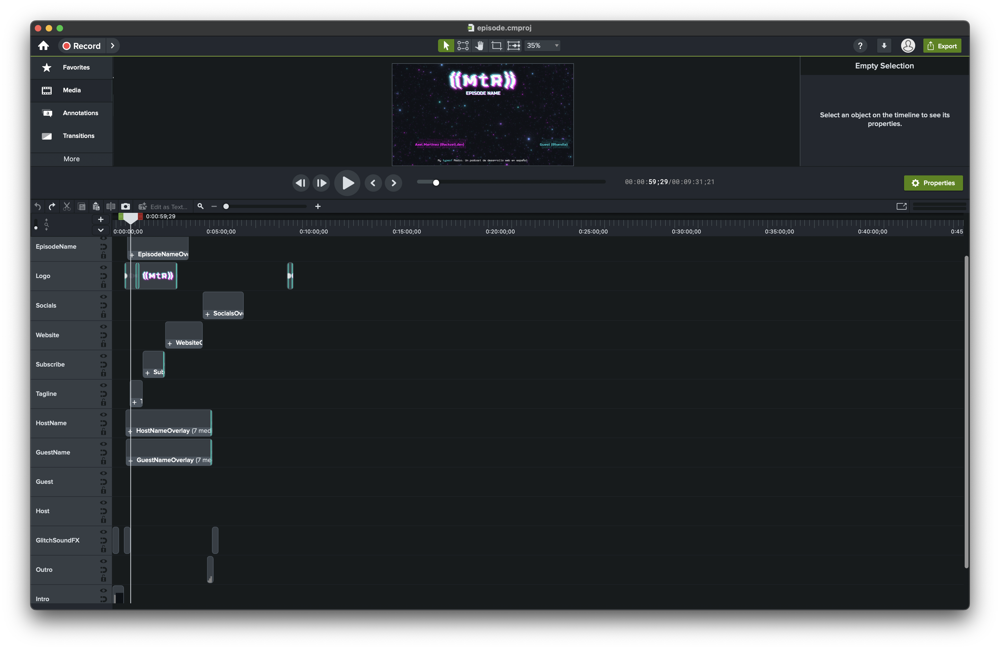
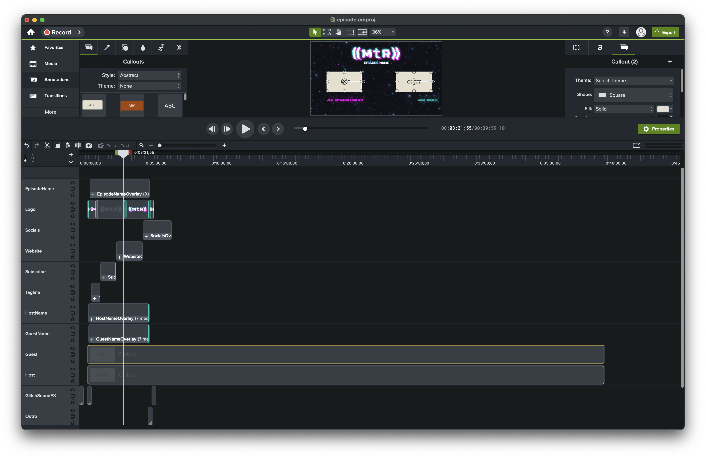
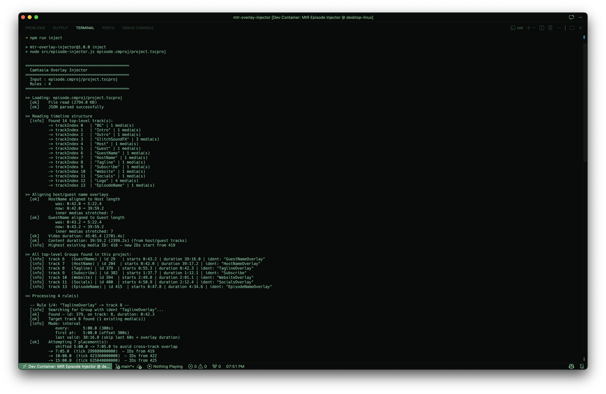
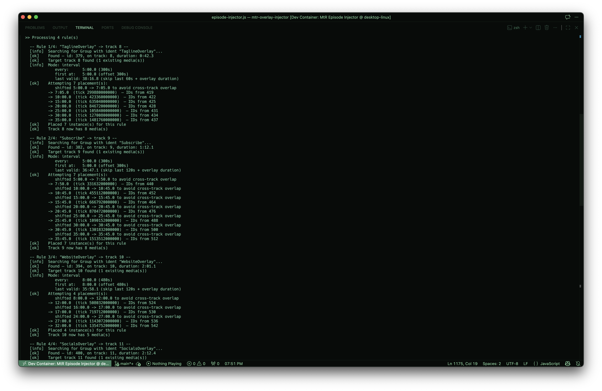
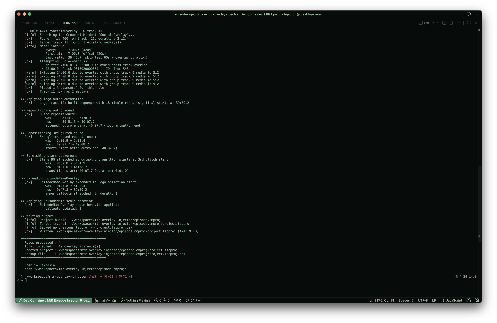
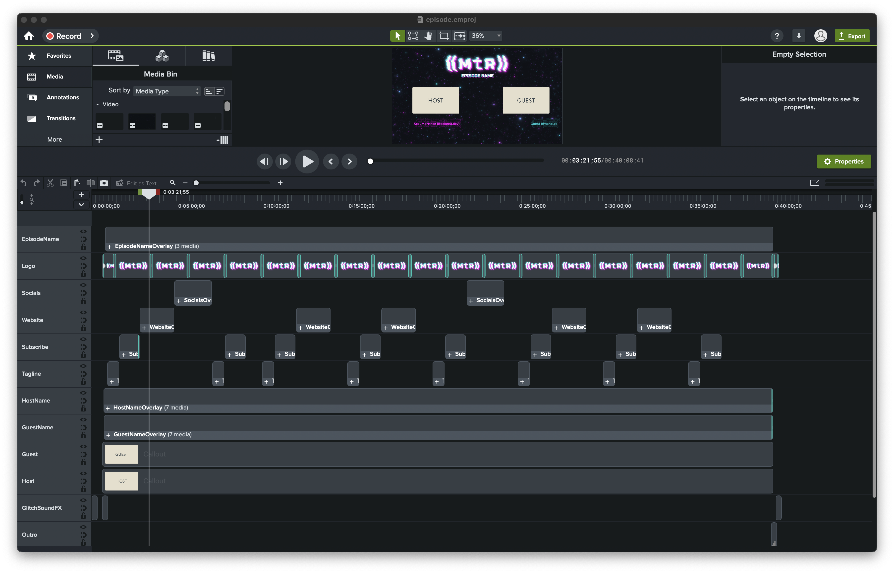

# Camtasia Editor Episode injector

This is a way for a specific kind of episode for the (( My typeof Radio )) podcast to be edited in a more efficient way.

Once the episode is edited and the final length is known, some overlays and other elements are added as the post-production. This script is used to automate the process of adding these elements to the episode.

* It will find overlays (clips) that repeat throughout the episode, and spread them evenly:
    - Social Network logos
    - Website URL
    - Subscribe button Call To Action
    - A Tagline at the bottom of the screen

* Create the outro sequence for the episode, which includes:
    - The end animation for the logo after the host's timeline ends
    - The outro music track, which matches the end of the logo animation
    - A glitch sound effect that plays when the outro music ends

* Extend the lenght of certain elements to match the length of the episode, such as:
    - The background video (stars field)
    - The text for the episode name (there is special logic to also provide the "Camtasia behavior" to the text so it animates in and out of the screen properly)
    - The overlays for the name and handle of the host and guest

# The technical details

> [!NOTE]
> As mentioned, this is specific to a certain kind of episode: A video podcast with 2 people (host and guest or two hosts) will work best without needing to change anything on the base file. 


There is a JS script ([`src/episode-injector.js`](./src/episode-injector.js)) that will read the `project.tscproj` file in a MacOS Camtasia Editor project and take specific entities from it to do several updates to the file, which are described above.

It was also conceived as a dev container, so it can be run in a consistent environment across different machines. The dev container configuration is in the [`devcontainer.json`](./.devcontainer/devcontainer.json) file, and it uses a NodeJS 24 image as the base.

Camtasia Editor must be installed if you want to see the results and actually export the video episode.

# How to use it

> [!IMPORTANT]
> This repository uses [Git LFS](https://git-lfs.github.com) to manage large media files. When cloning, ensure Git LFS is installed:
> ```bash
> git lfs install
> git clone <repository-url>
> ```
> If cloning with the dev container, Git LFS will be installed automatically.

1. Open the `episode.cmproj` file in Camtasia Editor and add the host and guest's content. 

    

    

    Do not worry about the rest of the elements, that is what the script is for. **CLOSE CAMTASIA EDITOR NOW**


2. Once you have the episode edited and the final length of the host and guest is known, you can run the script to _inject_ the elements and make the necessary adjustments to the project file.

    * In a dev container:

        1. Clone the repository and open it in VSCode
        2. Open the command palette and select "Dev Containers: Reopen in Container"
        3. Once the container is running, point your terminal to the root of the project and you can simply run 

            ```bash
            $ npm run inject
            ```

    * As another option, given that there are actually no dependencies or build steps, you can also run the script directly with NodeJS if you have it installed:

        ```bash
        $ node src/episode-injector.js
        ```
    
    
    

3. After running the script, open the `episode.cmproj` file in Camtasia Editor and you should see all the new elements added to the timeline, as well as the adjustments made to the existing ones.


4. Export the episode as you normally would.

5. Go touch some grass as the kids say, now you've got some time to spare thanks to the automation of the process.